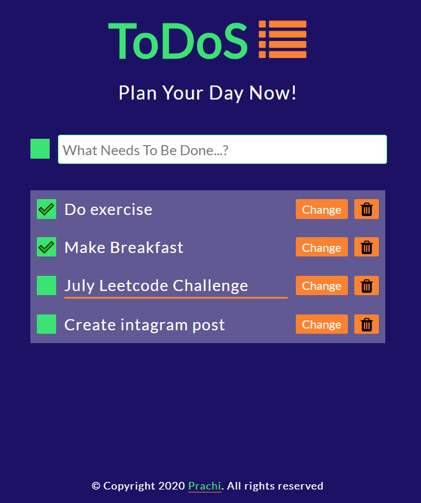

<h1>Vanilla JS ToDo App</h1>

### Preview :

> Get the demo here : [JS ToDoS](https://pm0824.github.io/Javascript-TODO-App/)

> For more javscript projects follow me here : [Codepen](https://codepen.io/girl_inwebdev)

> Visit my Instagram Account for web development related posts : [girl.inwebdev](https://www.instagram.com/girl.inwebdev/)

